# Allergy AI Companion — Database ERD

Source of truth: [`allergy_ai.dmm`](allergy_ai.dmm) — open in **Luna Modeler**
(Datensen). `File → Open` and pick the `.dmm`. Regenerate with
[`gen_dmm.py`](gen_dmm.py); the same script also emits
[`01_schema.sql`](../../backend/db/init/01_schema.sql).

Two ways to view it in Luna Modeler:

1. **Open the `.dmm` directly** — no database needed.
2. **Reverse-engineer** — run `01_schema.sql` into Postgres (docker-compose
   does this automatically via `backend/db/init/`), then in Luna: new
   PostgreSQL connection → reverse engineer. Use this if you prefer Luna to
   draw the model from a live DB.

## Diagram

```mermaid
erDiagram
    users ||--o{ user_allergies : has
    users ||--o{ conversations : starts
    users ||--o{ symptom_events : reports
    users ||--o{ alerts : receives
    users ||--o{ hospital_searches : runs
    conversations ||--o{ messages : contains
    conversations ||--o{ symptom_events : produces
    symptom_events ||--|| triage_results : evaluated_by
    environment_snapshots ||--o{ alerts : triggers
    hospital_searches ||--o{ hospital_results : returns

    users {
        serial id PK
        varchar email UK
        varchar password_hash
        numeric latitude
        numeric longitude
        timestamp created_at
        timestamp updated_at
    }
    user_allergies {
        serial id PK
        integer user_id FK
        varchar allergen "TREE_POLLEN|GRASS_POLLEN|WEED_POLLEN|PM25|PM10|DUST|MOLD|OTHER"
        varchar severity "MILD|MODERATE|SEVERE"
        timestamp created_at
    }
    conversations {
        serial id PK
        integer user_id FK
        varchar status "ACTIVE|COMPLETED|ABANDONED"
        timestamp created_at
        timestamp updated_at
    }
    messages {
        serial id PK
        integer conversation_id FK
        varchar role "USER|ASSISTANT|SYSTEM"
        text content
        timestamp created_at
    }
    symptom_events {
        serial id PK
        integer user_id FK
        integer conversation_id FK
        jsonb symptoms
        integer severity "0-10"
        varchar duration
        varchar possible_trigger
        boolean breathing_difficulty
        boolean airway_swelling
        timestamp created_at
    }
    triage_results {
        serial id PK
        integer symptom_event_id FK
        varchar risk_level "LOW|MODERATE|EMERGENCY"
        text recommendation
        varchar rule_version
        timestamp created_at
    }
    environment_snapshots {
        serial id PK
        numeric latitude
        numeric longitude
        varchar tree_pollen
        varchar grass_pollen
        varchar weed_pollen
        numeric pm25
        numeric pm10
        numeric temperature
        numeric humidity
        numeric wind_speed
        varchar risk_level
        timestamp captured_at
    }
    alerts {
        serial id PK
        integer user_id FK
        integer environment_snapshot_id FK
        varchar risk_level
        varchar alert_type "POLLEN|AIR_QUALITY|WEATHER|GENERAL"
        text message
        boolean is_read
        timestamp created_at
    }
    hospital_searches {
        serial id PK
        integer user_id FK
        numeric latitude
        numeric longitude
        varchar specialty
        timestamp created_at
    }
    hospital_results {
        serial id PK
        integer hospital_search_id FK
        varchar name
        varchar address
        integer distance_m
        varchar specialty
        boolean is_open
        varchar phone
        varchar place_id
        integer rank
        timestamp created_at
    }
```

## Notes on the design

- The 6 tables in the documentation (§9) are all here. Four were added because
  the architecture needs them: `conversations` + `messages` (the chat needs a
  `conversation_id`), `triage_results` (rule-engine output, audited separately
  from the LLM per §4), and `hospital_results` (ranked facilities from a search).
- Enum-like fields are `VARCHAR` with allowed values in the column comment. The
  app enforces them as real enums in code; the DB stays simple to reverse-engineer.
- `ON DELETE CASCADE` for owned rows; `SET NULL` where the child can outlive the
  parent (`symptom_events.conversation_id`, `alerts.environment_snapshot_id`).
